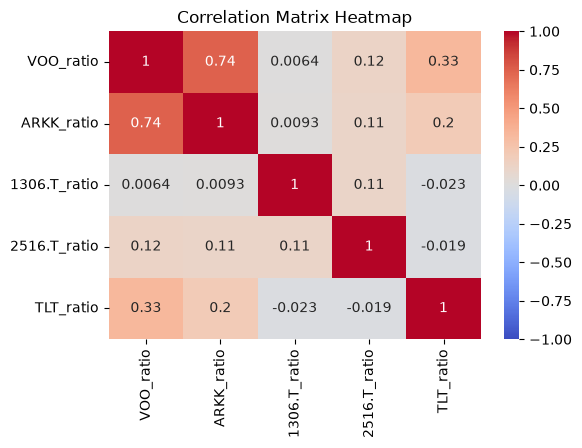
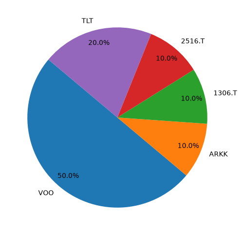

# 010-portfolio-optimisation

yfinance で取得した複数銘柄の価格データを用いて、CVXPY による制約付きポートフォリオ最適化を試した。

## Summary

米国・日本の株式および債券ETFを対象に、過去5年間の価格データからポートフォリオの配分比率を最適化した。

今回は金融工学を深く扱うことを目的とせず、**CVXPYを用いて、複数の制約条件を持つ最適化問題を実際のデータに適用してみること**を主な目的とした。

対象銘柄は以下の5銘柄とした。

* VOO
* ARKK
* 1306.T
* 2516.T
* TLT

なお、米国銘柄はUSD/JPYを用いて円換算し、また、銘柄ごとの価格水準の違いを考慮した。

## Approach

### 1. 株価データの取得

`yfinance` を利用して、対象銘柄とUSD/JPYの過去5年間の終値を取得した。

取得したデータには一部欠損があったため、今回は前日の値を引き継ぐ `forward fill` で補完した。

米国銘柄についてはUSD/JPYを掛けて円換算し、日本株と比較できるようにした。

### 2. 前日比への変換

銘柄ごとに価格の桁が異なるため、そのまま価格を比較するのではなく、各銘柄の値動きを**前日比（リターン）**として扱った。

これにより、例えば株価が数千円の銘柄と数万円の銘柄を、価格そのものの大きさではなく、日々の変動率という共通の尺度で比較した。

また、前日比の相関係数を確認し、銘柄同士の値動きの関係も確認した。

  

### 3. CVXPYによるポートフォリオ最適化

平均リターンとリスクの両方を考慮し、

**期待リターン − リスクへのペナルティ**

を最大化する目的関数を設定した。

リスクにはポートフォリオの分散を使用し、リターンとリスクのバランスを調整するパラメータとして `gamma = 5.0` を設定した。

最適化には `CVXPY` を使用した。

### 4. 分散投資の制約

過去のデータだけを見ると、特定の銘柄に100%投資した場合に最も高いリターンとなるケースがある。

しかし、これは**現在から振り返って過去の値動きを見た結果に過ぎず、将来も同じ結果になるとは限らない**。

そこで今回は、単純に過去のリターンが最大となる銘柄へ集中させるのではなく、分散投資を意識して以下の制約を設定した。

* 5銘柄への投資比率の合計を100%とする
* 各銘柄に最低10%投資する
* 1銘柄あたりの投資比率を最大50%とする

これにより、特定の1銘柄に極端に依存しないポートフォリオを求めた。

## Results

CVXPYによる最適化によって、設定した目的関数と制約条件を満たすポートフォリオの投資比率を求めた。

最適化された各銘柄の比率を下図に示す。  

また、今回の分析では、過去の値動きだけを見れば特定銘柄への集中投資が有利になるケースがあることも確認できた。

一方で、実際の投資では将来の値動きは未知であるため、今回は「過去の結果が最も良かった銘柄に全額投資する」という考え方ではなく、**あらかじめ制約を設定した上で、その範囲内で最適な配分を求める**という形で最適化を行った。

## What I Learned

今回の主な学びは、**最適化問題を数式として定義し、制約条件を含めて解くことができる**という点である。

単純に「リターンが最大になる銘柄」を探すだけではなく、

* 期待リターンをどの程度重視するか
* リスクをどのように定義するか
* 1銘柄への集中をどこまで許容するか
* 最低投資比率を設定するか

といった条件を目的関数・制約条件として明示することで、より柔軟に最適化問題を設計できることを確認した。

特にCVXPYでは、これらの条件を比較的シンプルに記述できるため、二兎を追う者は一兎をも得ずではないが、**「最適化したいもの」と「守らせたい条件」を分けて考える**ことの重要性を学んだ。

## Limitations

今回はあくまで最適化手法を試すことを目的としており、金融工学としての厳密なポートフォリオ分析までは扱っていない。

また、過去5年間のデータから平均リターンと共分散を計算しているため、最適化結果は過去のデータに強く依存する。

特に、過去のデータを見た上で「この銘柄に投資していれば最もリターンが高かった」と判断することは、将来の投資判断とは異なる。

そのため、今回求めたポートフォリオを実際の投資判断にそのまま利用することは想定していない。

## Future Work

今回は基本的な制約付き最適化に留めたが、発展させる場合には以下のような検討が考えられる。

* `gamma` を変化させた場合のリスク・リターンの比較
* 最小分散ポートフォリオとの比較
* 制約条件を変えた場合の最適ウェイトの変化
* 過去データで最適化したポートフォリオを、その後の期間で評価するバックテスト
* より多くの銘柄を対象とした最適化
* CVXPY以外の最適化手法との比較

## Tools

* Python
* pandas
* NumPy
* yfinance
* CVXPY
* matplotlib
* seaborn

## Dataset

株価データおよび為替データは `yfinance` を利用して取得した。

取得したデータは再取得時の差異や外部サービスへの過度なアクセスを避けるため、CSVとして保存して使用している。

> **Note:**
> 本プロジェクトは、ポートフォリオ最適化を題材とした技術的な実験です。
> 実際の投資判断や金融商品の売買を推奨するものではありません。
