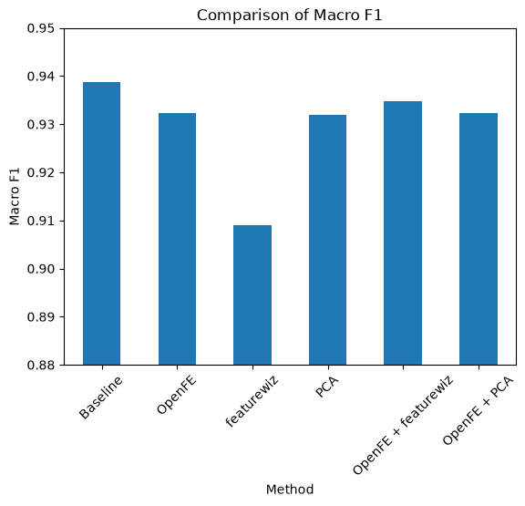
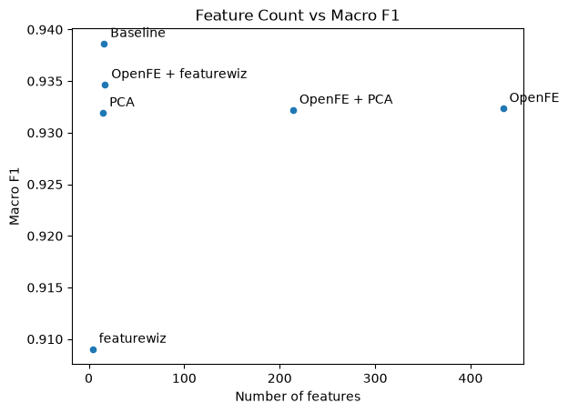

# 012-dry-bean-classification

UCI Dry Bean Datasetを用いた、特徴量生成・特徴量選択・次元削減手法の比較実験。

## Overview

本プロジェクトでは、UCI Machine Learning RepositoryのDry Bean Datasetを用いて、LightGBMによる7クラス分類を行った。

Baselineモデルを基準として、以下の特徴量生成・特徴量選択・次元削減手法を比較した。

- OpenFE
- featurewiz
- PCA
- OpenFE + featurewiz
- OpenFE + PCA

「特徴量を増やすことでモデル性能が向上するのか」、  
「特徴量選択や次元削減によって、性能を維持しながら特徴量数を減らせるのか」、  
を実験的に確認した。

## Dataset

[UCI Dry Bean Dataset](https://archive.ics.uci.edu/dataset/602/dry+bean+dataset)を使用。

- データ数: 13,611
- 特徴量数: 16
- 目的変数: `Class`
- クラス数: 7

各特徴量は、乾燥豆の形状やサイズに関する数値情報で構成されている。

## Experiments

### Baseline

元の16特徴量をそのまま使用し、LightGBMで分類した。

### Baseline + OpenFE

OpenFEによって特徴量を自動生成し、生成された特徴量をLightGBMに入力した。

### Baseline + featurewiz

featurewizによって特徴量選択を行い、選択された特徴量をLightGBMに入力した。

### Baseline + PCA

StandardScalerで標準化した後、PCAによって次元削減を行い、LightGBMに入力した。

### OpenFE + featurewiz

OpenFEで生成した特徴量に対してfeaturewizを適用し、特徴量を選択した。

434特徴量まで増加した特徴量を17特徴量まで削減し、LightGBMで分類した。

### OpenFE + PCA

OpenFEで生成した特徴量に対してPCAを適用し、次元削減を行った。

434特徴量から214特徴量まで削減し、LightGBMで分類した。

## Results

評価指標には、7クラスの不均衡を考慮して **Macro F1** を使用した。

### Feature Count vs Macro F1

特徴量数とMacro F1の関係を比較した。

| Method | Number of features | Macro F1 |
| --- | ---: | ---: |
| Baseline | 16 | **0.938652** |
| OpenFE | 434 | 0.932365 |
| featurewiz | 4 | 0.909033 |
| PCA | 15 | 0.931941 |
| OpenFE + featurewiz | 17 | 0.934675 |
| OpenFE + PCA | 214 | 0.932208 |

グラフ化し、下記に掲載する。  

## Findings

今回の実験では、**Baselineが最も高いMacro F1を達成した。**

特に、OpenFEでは16特徴量から434特徴量まで大幅に増加したものの、Macro F1はBaselineの0.938652から0.932365に低下した。

一方、OpenFE + featurewizでは434特徴量から17特徴量まで削減しながら、Macro F1 0.934675を達成した。

この結果から、**特徴量数を増やせば必ずしもモデル性能が向上するわけではない**ことが確認できた。

また、Baselineが最も高い性能だったことから、今回のデータセットでは、  
**元々用意されている16個の特徴量だけでもクラス分類を十分に説明できる表現力を有していた可能性がある。**

## Conclusion

今回の実験では、特徴量生成・特徴量選択・次元削減を組み合わせて比較した。

結果として、最も高いMacro F1を得られたのはBaselineだった。

一方で、OpenFE + featurewizでは、OpenFEによって大幅に増加した特徴量を17個まで削減しながら、Baselineに近い性能を維持できた。

今回の結果から、特徴量エンジニアリングではただ風呂敷を広げるように単純に特徴量を増やすのではなく、  
**データセットの性質やモデルとの組み合わせを考慮して手法を選択することが重要**だと分かった。

## Environment

- Python 3.11
- LightGBM
- OpenFE
- featurewiz
- scikit-learn
- pandas
- NumPy
- matplotlib
- seaborn